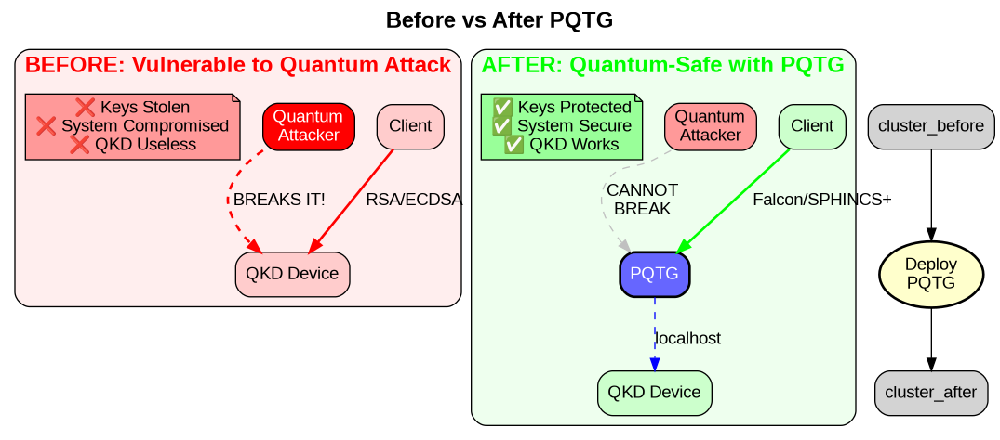
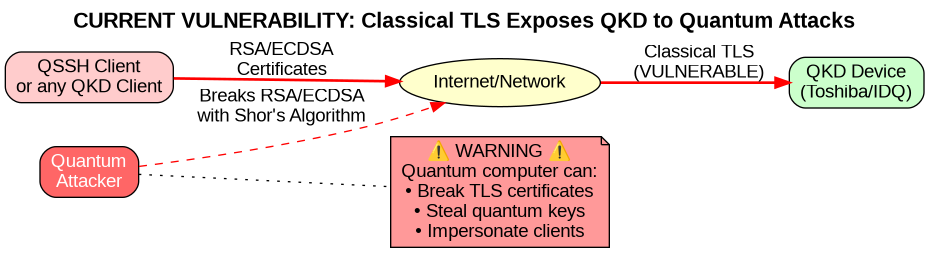
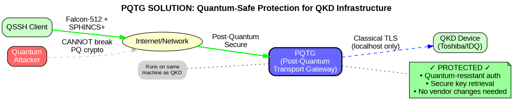
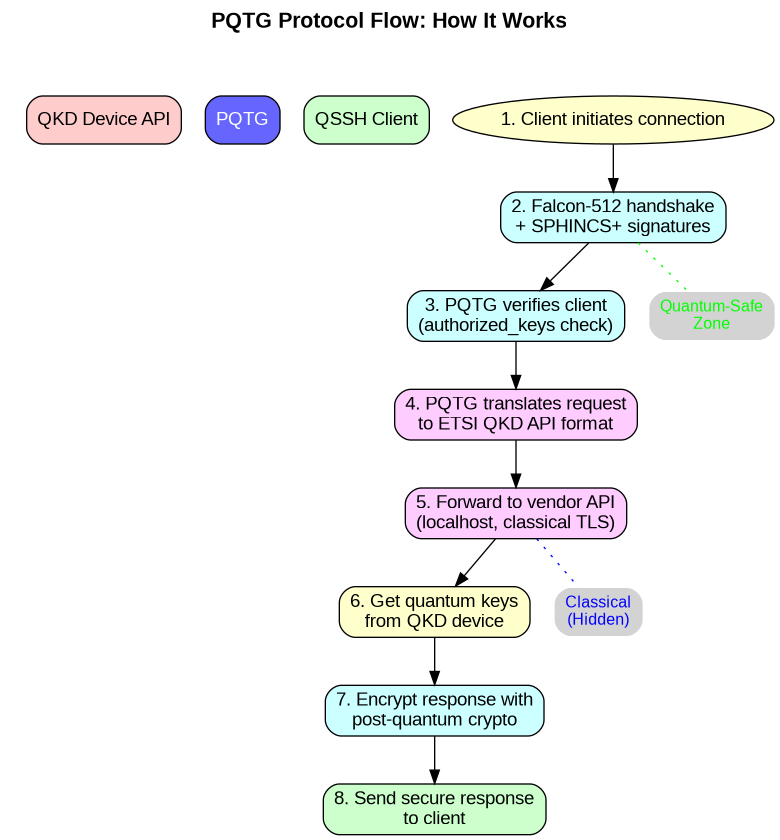
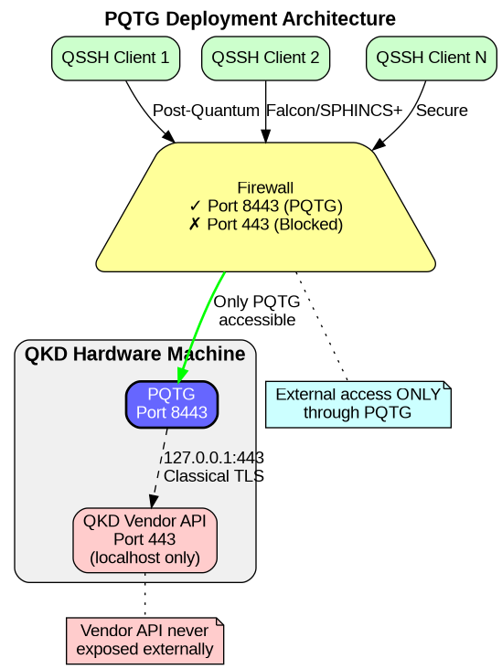

# PQTG - Post-Quantum Transport Gateway

A security gateway that replaces vulnerable classical TLS (Transport Layer Security) with post-quantum cryptography for QKD infrastructure, protecting against quantum computer attacks on authentication and transport.



## The Problem: QKD's Achilles Heel



QKD vendors (Toshiba, IDQuantique) use classical TLS for their management APIs, creating a vulnerability where TLS certificates could be compromised by quantum computers, allowing attackers to steal quantum keys. This completely undermines the quantum security that QKD is supposed to provide!

## The Solution: PQTG



PQTG acts as a quantum-safe shield:
1. Runs directly on the QKD machine (localhost access only)
2. Exposes a quantum-safe API using Falcon + SPHINCS+
3. Translates requests to the vendor's TLS API
4. Ensures external access is always post-quantum secure

## How It Works



## Deployment Architecture



## Installation

For Quantum Network Operators:

```bash
# On your QKD hardware (Toshiba/IDQ)
git clone https://github.com/QuantumVerseProtocols/pq-qkd-proxy
cd pq-qkd-proxy
cargo build --release
sudo ./install.sh
```

## Configuration

Edit `/etc/pq-qkd-proxy/config.toml`:

```toml
[proxy]
# Listen only on specific interface for external quantum-safe access
listen = "192.168.1.100:8443"

[qkd]
# Vendor API (localhost only)
vendor_api = "https://localhost:443"
vendor_cert = "/etc/qkd/vendor-cert.pem"

[security]
# Post-quantum algorithms
pq_algorithm = "falcon512"
sig_algorithm = "sphincsplus"

# Authorized QSSH clients
authorized_keys = "/etc/pq-qkd-proxy/authorized_keys"
```

## Security Features

- **No External TLS**: Vendor's vulnerable TLS is never exposed
- **Post-Quantum Only**: All external connections use Falcon/SPHINCS+
- **Localhost Isolation**: Vendor API only accessible from 127.0.0.1
- **Key Rotation**: Automatic rotation of proxy keys
- **Audit Logging**: All key requests are logged

## For QSSH Integration

QSSH clients connect to this proxy instead of directly to QKD hardware:

```rust
// In QSSH configuration
qkd_endpoint: "https://qkd.operator.net:8443"  // This proxy
// NOT: "https://qkd-hardware.local"           // Vendor's TLS
```

## Deployment Checklist

- [ ] Install on QKD hardware (not external server)
- [ ] Configure firewall to block direct QKD API access
- [ ] Generate Falcon/SPHINCS+ keys for proxy
- [ ] Add authorized QSSH client keys
- [ ] Test quantum-safe connection
- [ ] Monitor audit logs

## License

MIT - Open source for quantum network operators to deploy freely