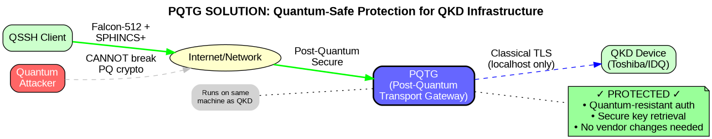
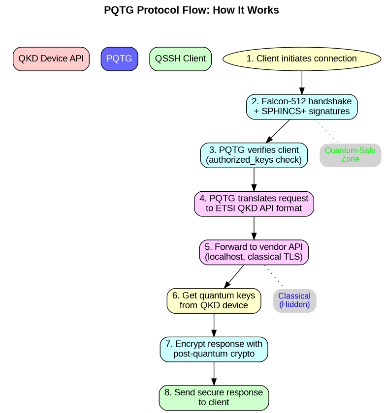

# PQTG Visual Guide

## Understanding the Problem and Solution

### 1. The Current Vulnerability


**What's wrong with this picture?**
- QKD devices use RSA/ECDSA certificates (classical cryptography)
- Quantum computers can break these with Shor's algorithm
- An attacker could steal the "quantum-secure" keys!
- This defeats the entire purpose of QKD

### 2. How PQTG Fixes It



**The PQTG advantage:**
- External connections use post-quantum crypto (Falcon-512 + SPHINCS+)
- Quantum computers CANNOT break these algorithms
- Vendor's classical TLS is hidden on localhost
- No changes needed to QKD hardware

### 3. Step-by-Step Protocol Flow



**What happens during a key request:**
1. Client connects with post-quantum authentication
2. PQTG verifies client using authorized_keys
3. Request is translated to vendor's API format
4. QKD keys are retrieved via localhost connection
5. Response is encrypted with post-quantum crypto
6. Client receives quantum keys securely

### 4. Network Deployment


**Key deployment points:**
- PQTG runs ON the QKD machine (not separate)
- Firewall blocks direct access to vendor API (port 443)
- Only PQTG port (8443) is accessible externally
- Multiple clients can connect securely
- Vendor API is never exposed to the network

## Why This Matters

Without PQTG:
```
Quantum Computer → Breaks TLS → Steals QKD Keys → Game Over
```

With PQTG:
```
Quantum Computer → Cannot Break PQ Crypto → Keys Safe → QKD Works As Intended
```

## Quick Setup

1. Install PQTG on your QKD machine
2. Block external access to vendor API (firewall rule)
3. Configure authorized client keys
4. Point QSSH/clients to PQTG instead of vendor API
5. Enjoy quantum-safe QKD access!

Remember: **The weakest link determines the security of the entire system!**